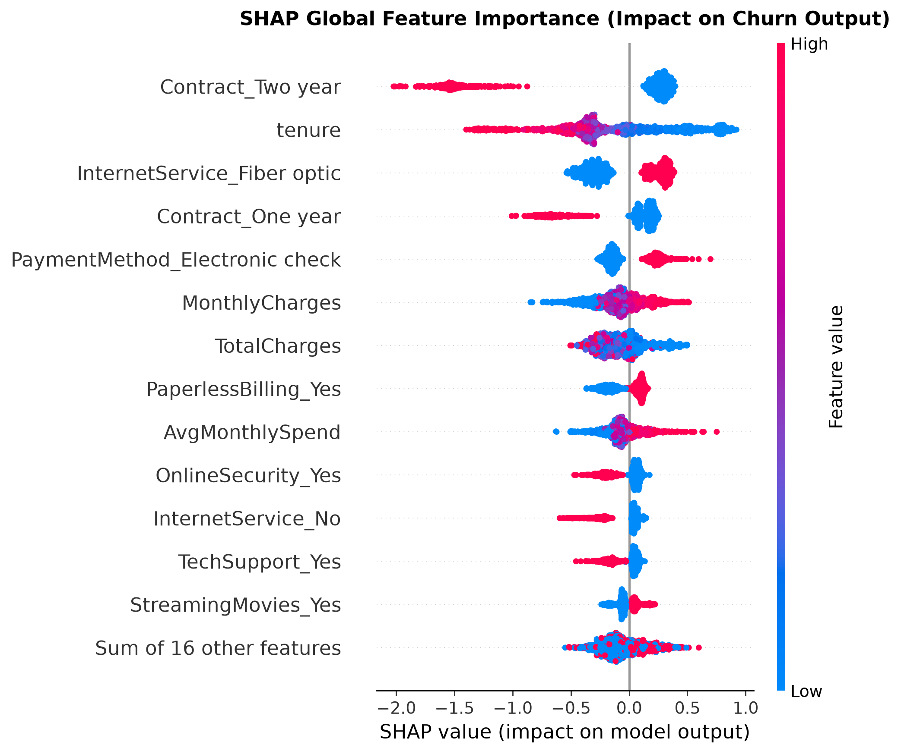
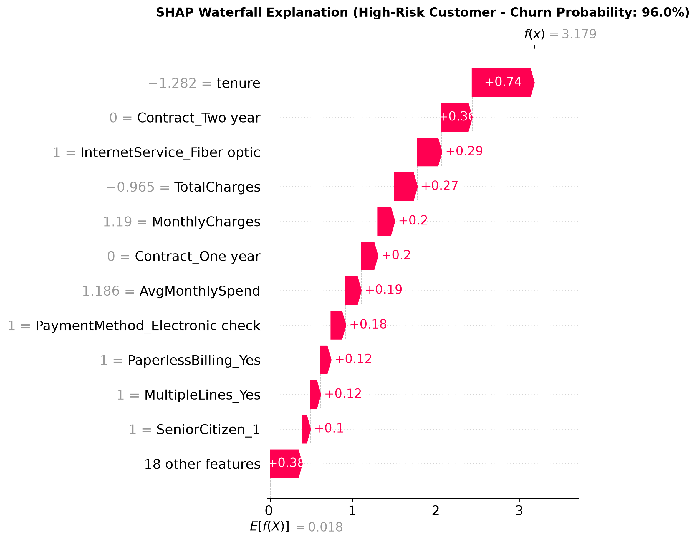
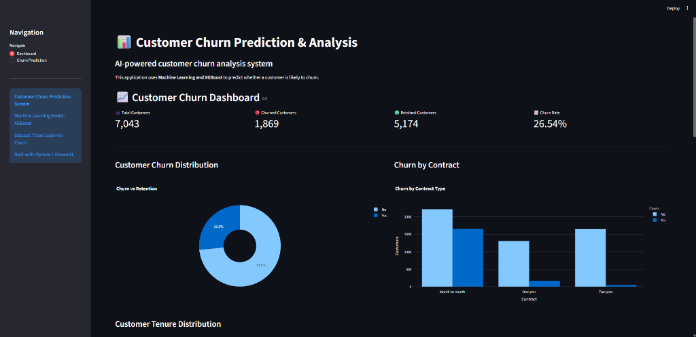
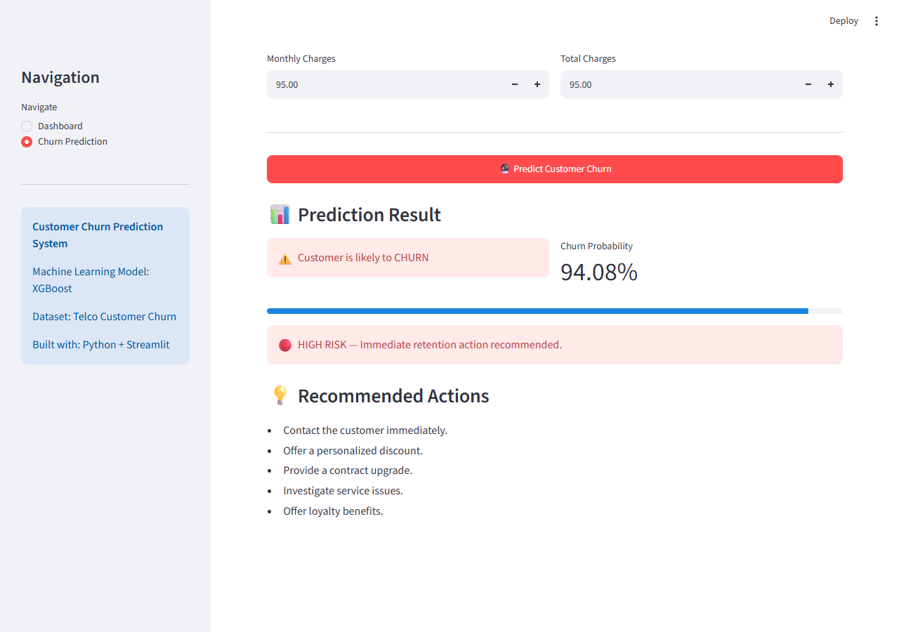
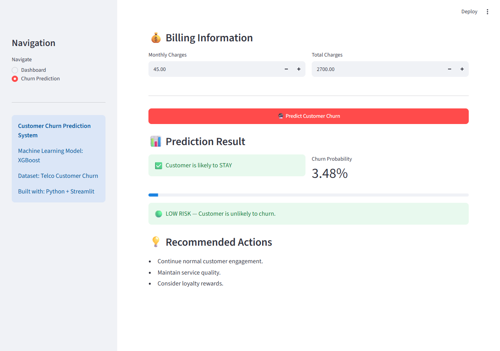

# 📊 Customer Churn Prediction & Analysis System

An end-to-end machine learning system that predicts customer churn, explains the reasoning behind each prediction using SHAP, and serves both an analytical dashboard and a live prediction interface through Streamlit.

---

## 📌 Project Overview

Customer churn — when a customer stops using a company's service — is one of the most costly problems in subscription-based businesses. This project builds a complete, production-style pipeline that:

- Analyzes historical telecom customer data to uncover churn patterns
- Trains and compares multiple machine learning models
- Selects a final model based on rigorous, multi-metric evaluation (not accuracy alone)
- Explains *why* the model makes each prediction using SHAP (Explainable AI)
- Serves predictions through an interactive Streamlit web application

---

## 🎯 Problem Statement

Telecom companies lose significant revenue when customers churn, and by the time churn happens, it's too late to intervene. The goal of this project is to predict **which customers are at risk of churning**, and **why**, so that retention efforts can be targeted proactively rather than reactively.

---

## 🎯 Objectives

1. Identify the key factors driving customer churn
2. Build a classification model to predict churn probability
3. Address class imbalance without sacrificing model reliability
4. Provide transparent, explainable predictions (not a black box)
5. Deliver an interactive tool usable by non-technical stakeholders

---

## 📂 Dataset

**Source:** [Telco Customer Churn — Kaggle](https://www.kaggle.com/datasets/blastchar/telco-customer-churn)

- **Size:** 7,043 customers, 21 original columns
- **Target variable:** `Churn` (Yes/No)
- **Class distribution:** 73.5% No / 26.5% Yes (moderate imbalance)

Key columns include customer demographics (gender, senior citizen status, partner/dependents), account information (tenure, contract type, payment method), subscribed services (internet, streaming, security add-ons), and billing details (monthly/total charges).

---

## 🛠️ Technologies Used

| Category | Tools |
|---|---|
| Language | Python |
| Data Analysis | Pandas, NumPy |
| Visualization | Matplotlib, Seaborn, Plotly |
| Machine Learning | Scikit-learn, XGBoost |
| Explainability | SHAP |
| Model Persistence | Joblib, XGBoost native format |
| Web App | Streamlit |
| Development | Google Colab |

---

## 🏗️ Project Architecture

```
Raw Dataset (Kaggle)
        ↓
Data Cleaning & Validation
        ↓
Exploratory Data Analysis
        ↓
Feature Engineering
        ↓
Preprocessing Pipeline (ColumnTransformer)
        ↓
Model Training (Logistic Regression, Random Forest, XGBoost)
        ↓
Class Imbalance Handling
        ↓
Hyperparameter Tuning
        ↓
SHAP Explainability
        ↓
Model Persistence
        ↓
Streamlit Application (Dashboard + Prediction)
```

---

## 🧹 Data Preprocessing

- **`TotalCharges`** was loaded as a text column due to 11 blank-string entries. These were all confirmed (not assumed) to belong to customers with `tenure = 0` — brand-new customers who hadn't been billed yet — and were filled with `0` accordingly.
- No duplicate rows were found.
- Categorical columns like `OnlineSecurity`, `TechSupport`, etc. contained a redundant `"No internet service"` category, which was collapsed into `"No"` since it duplicated information already captured by `InternetService`.
- `customerID` was dropped as a non-predictive identifier.
- Preprocessing (scaling + one-hot encoding) was fit **only on training data** to prevent data leakage, then applied to the test set.

---

## 🔍 Key EDA Findings

| Factor | Finding |
|---|---|
| **Contract type** | Month-to-month customers churn at **42.7%**, vs. 11.3% (one-year) and 2.8% (two-year) |
| **Tenure** | Churn is heavily concentrated among customers with low tenure |
| **Internet service** | Fiber optic customers churn at **41.9%**, more than double DSL customers (19.0%) |
| **Payment method** | Electronic check users churn at **45.3%**, ~3x higher than any automatic payment method |
| **Monthly charges** | Churned customers pay noticeably higher average monthly charges |

These patterns were later confirmed independently by SHAP feature importance, adding confidence that the model learned genuine signal rather than noise.

---

## 🧬 Feature Engineering

| Feature | Description | Rationale |
|---|---|---|
| `TenureGroup` | Binned tenure into 4 groups | Captures the non-linear, front-loaded nature of churn risk |
| `NumServices` | Count of subscribed add-on services (0–6) | Proxies customer "investment" in the platform |
| `HasInternetAndPhone` | Binary flag for bundled service | Tests whether bundling affects retention |
| `AvgMonthlySpend` | `TotalCharges / tenure` | Highlights potential spend-rate inconsistencies |

---

## 🤖 Machine Learning Models

Three models were trained and compared on identical preprocessed data:

| Model | Accuracy | Precision | Recall | F1-Score | ROC-AUC |
|---|---|---|---|---|---|
| Logistic Regression | 79.9% | 65.3% | 51.9% | 57.8% | 84.3% |
| Random Forest | 79.2% | 63.5% | 50.8% | 56.5% | 82.5% |
| XGBoost | 77.6% | 59.4% | 50.0% | 54.3% | 81.6% |

**Initial finding:** untuned Logistic Regression outperformed both ensemble models — a reminder that model complexity isn't a guarantee of better performance without tuning.

### Addressing Class Imbalance

Class weighting and SMOTE were tested (applied only to training data, to avoid leakage):

| Approach | Recall | F1-Score |
|---|---|---|
| Original models | ~50–52% | ~0.54–0.58 |
| Class-weighted / SMOTE | **~66–79%** | **~0.59–0.62** |

Addressing the imbalance substantially improved recall — the model's ability to actually catch churners — at a reasonable cost to precision.

### Hyperparameter Tuning

`GridSearchCV` (Logistic Regression) and `RandomizedSearchCV` (XGBoost) were used with 5-fold stratified cross-validation, optimizing for F1-score.

## ✅ Final Model: Tuned XGBoost

| Metric | Score |
|---|---|
| Accuracy | 75.6% |
| Precision | 52.6% |
| Recall | **80.7%** |
| F1-Score | **63.7%** |
| ROC-AUC | **84.7%** |

**Selected because:** it achieved the best F1-score and ROC-AUC of every model and configuration tested, with the strongest recall — correctly identifying roughly **81% of customers who actually churn**, which matters most in a retention context where missing a churner is costlier than a false alarm.

---

## 🧠 Explainable AI (SHAP)

### Global Feature Importance

The top predictors, ranked by mean absolute SHAP value:

1. Two-year contract
2. Tenure
3. Fiber optic internet service
4. One-year contract
5. Electronic check payment method
6. Monthly charges



### Individual Prediction Example

For a sample customer (month-to-month, DSL, electronic check, 17 months tenure), the model predicted a **63.4% churn probability**. SHAP attributed this primarily to:

- **Increasing risk:** electronic check payment (+0.29), no long-term contract (+0.27, +0.17), senior citizen status (+0.13)
- **Decreasing risk:** not having fiber optic internet (−0.34), moderate monthly charges (−0.06)



---

## 💻 Streamlit Application

### Dashboard
Displays total/churned/retained customer counts, churn rate, and interactive charts (churn by contract, tenure, internet service, payment method, and senior citizen status).



### Churn Prediction
An interactive form collects customer details and returns:
- Predicted class (Churn / Stay)
- Churn probability
- Risk category (Low / Medium / High, stratified at 50% and 75% thresholds)
- Recommended retention actions based on risk level

| High Risk Prediction | Low Risk Prediction |
| :---: | :---: |
|  |  |

**Note:** Because the trained pipeline expects engineered features (`TenureGroup`, `NumServices`, `HasInternetAndPhone`, `AvgMonthlySpend`), the app recomputes these from raw form inputs before prediction, mirroring the notebook's feature engineering step exactly.

---

## ⚙️ Installation & Setup

```bash
# Clone the repository
git clone https://github.com/Deneshkar/customer_churn_ai.git
cd customer_churn_ai

# Install dependencies
pip install -r requirements.txt
```

## ▶️ How to Run

```bash
cd app
streamlit run app.py
```

The app will open automatically in your browser at `http://localhost:8501`.

---

## ⚠️ Known Limitations

- The prediction form allows some logically inconsistent input combinations (e.g., "No Phone Service" alongside "Multiple Lines: No") that don't occur in the training data. The pipeline handles these gracefully without crashing, but predictions on such inputs are extrapolations beyond the model's training distribution.
- Model performance (F1 ≈ 0.64) reflects a genuine, moderate-imbalance classification problem — it is not a "solved" prediction, and should be treated as a decision-support signal, not a certainty.
- Risk thresholds (50% / 75%) are illustrative defaults, not derived from a specific business cost-benefit analysis.

## 🚀 Future Improvements

- Add input validation to prevent logically inconsistent form combinations
- Deploy to Streamlit Community Cloud for public access
- Experiment with additional models (LightGBM, CatBoost)
- Add SHAP explanations directly within the prediction page, per-customer
- Incorporate a monitoring component to track model performance drift over time

---

## 👤 Author

**Deneshkar Punyamoorthy**  
Full Stack Developer | Software Engineering Undergraduate, SLIIT  

[LinkedIn](https://www.linkedin.com/in/deneshkar-punyamoorthy-450931350) · [GitHub](https://github.com/Deneshkar) · [Portfolio](https://deneshkar.github.io/my-portfolio/)
